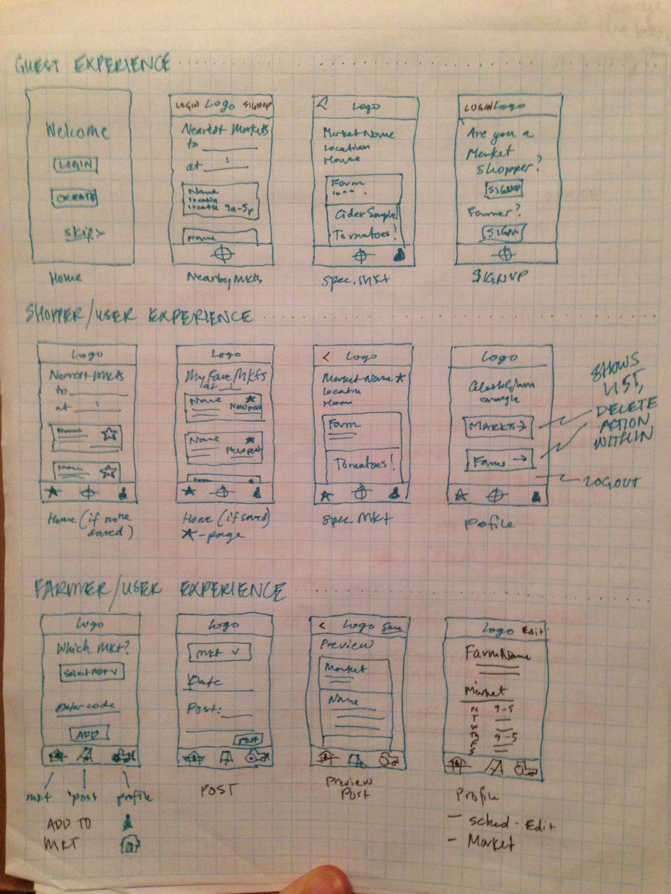

# Farmer's Market Finder
  
  A mobile app for Farmer's Markets in New York and their shoppers. My hope with this app is to encourage people to buy locally.

  When opened, the app uses geolocation to show the user's nearby Farmer's markets, it also has a search form to search by zip code. As a farmer, you can add your Farm to the Farmer's Market you have a booth at and make posts about any specials you're excited about. When a user clicks on a market, all relevant info about that market shows, including the location, contact info, and hours; as well as any recent posts made by the farmers who show at the market.

## User stories

  - A guest should be able to view their nearby Farmer's Markets and any posts made to it
  - A farmer should be able to add their Farm to the Farmer's Market page
  - A farmer should be able to post updates 

## Future Goals

  - A user (shopper) should be able to create accounts and save certain Markets they like
  - A user should be able to star Farms they like at a Market
  - A user should be able to see a feed of the most recent updates to their favorite markets and farms, when they open the app
  - There should be a map view
  - API data should compare with the current time and sort by season, ideally operation hours

## Technologies
  
  - NodeJS: back-end server with models for api data and user data
  - React Native: front-end user interface
    - Integrated with the <a href="http://nativebase.io/" target="_blank">NativeBase</a> framework
  - API: <a href="https://data.ny.gov/Economic-Development/Farmers-Markets-in-New-York-State-API/xjya-f8ng" target="_blank">Farmers Markets in NYC</a>
  - API: <a href="http://maps.googleapis.com/maps/api/geocode/json" target="_blank">Google Maps API</a> - converts lat and long to zip code for easier communication to Farmer's Market API
  - PSQL: 
    - Farmer table stores Farmer's name/contact info
    - Farmer Posts stores Farmer's posts and market info
    - Saved Markets stores the market info and farmer_id who saved it

## Wireframes

  Three different Experiences: guest, user (future goal), and farmer
  
  

## Special Thanks

  - <a href="https://facebook.github.io/react-native/docs/getting-started.html" target="_blank">React Native Docs</a>
  - Blog posts about:
    - <a href="https://www.appcoda.com/react-native-introduction/" target="_blank">Building with React Native</a>
    - <a href="https://www.appcoda.com/nativebase-sponsor/" target="_blank">Building with NativeBase</a>
    - <a href="https://scotch.io/tutorials/nativebase-the-missing-piece-of-react-native%E2%80%8B" target="_blank">Tutorials for NativeBase building</a>
  - Stack Overflow for existing
  - <a href="https://github.com/GeekyAnts/nativebase-tutorial?utm_source=syndicate&utm_medium=post&utm_campaign=scotch-jul2016" target="_blank">Geeky Ants Github</a>
  - <a href="https://auth0.com/blog/adding-authentication-to-react-native-using-jwt/" target="_blank">AuthO</a> for help with user auth and AsyncStorage
  - <a href="https://github.com/michaelshamah" target="_blank">Michael Shamah</a> for bouncing XCode Simulator, React Native, and NativeBase issues off of
  - <a href="http://fizal.me/" target="_blank">Fizal Serif</a> for his brain and eyes when I was frustrated
